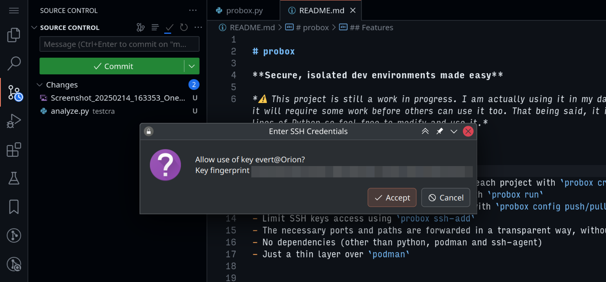

## The problem

As a developer, you likely run a lot of code you can’t or don’t have time to verify. Many modern projects have lots of dependencies, and none of the package managers I know provide any isolation from the rest of your system. For example, *create-react-app* will install 1400 dependencies from 285 authors. Do you trust all of them? More importantly, do you trust their security posture?

Eventually, this will go wrong. Many examples exist ([PyPI](https://arxiv.org/abs/2309.11021), [NPM](https://jfrog.com/blog/large-scale-npm-attack-targets-azure-developers-with-malicious-packages/), [AUR](https://sensorstechforum.com/arch-linux-aur-repository-found-contain-malware/)). Even though the lack of isolation is the de facto standard, I think this is borderline irresponsible. Especially as a freelance developer working for multiple clients. Therefore, while I can’t fully prevent supply-chain attacks, I can drastically minimize their potential damage.

In practice, this means I need a system to isolate projects from each other and from the system itself. However, it needs be easy to use, performant, and above all it needs to *get out of my way* while I'm working. I wrote a tool named [**probox**](https://github.com/evertheylen/probox), and after using it for a few months, I think I reached my goal.

This how the end result will look like, but read on for the details:


## How to isolate

Let’s get this out of the way first: if you’re looking for the strongest possible isolation, you need to use emulation (e.g. [Qubes OS](https://www.qubes-os.org/)). For my purposes, that seemed like too high a price in convenience and performance.

So I went with containers. After using `docker` in many projects before, I settled on using `podman` as it was more performant, has a stronger focus on security (e.g. rootless mode) and integrates better with Linux (e.g. systemd support).

In order to protect my projects from eachother and the host, I create a container per project. Exactly what constitutes one project is up to you.


### Stateful over stateless

Unlike most usages of containers, you want these “development” containers to *not* be disposable by default. Since you can’t foresee every tool or config you’ll ever need for development, your `Containerfile` will never be finished. So you’ll either spend an ungodly amount of time rebuilding your base image, or you’ll have to be very disciplined about using `podman commit`, or you’ll just lose all your progress upon every reboot. Best to just keep your containers stateful—this is the default anyway.


### Beefy containers

While stateful containers are assumed, it also shouldn't be *too* hard to (re)create containers. The more you include in your base image, the less work you'll have to do after creating a new container. OTOH, more software means a larger attack surface.

Eventually I settled on a pretty beefy base image with most of the tools I use during development already installed. This includes a fancy shell, compilers, debuggers, runtimes, language servers, an IDE with plenty of plugins, etc. I only pay the storage cost once, as the image is shared among all my containers.

You can find the base image I use [on github](https://github.com/evertheylen/probox/blob/main/arch-with-code-server/Containerfile), but you should probably modify it before you use it. It is based on Arch Linux, with tools for Python, Javascript, Rust and C/C++. I also include code-server (a hosted variant of VSCode) and configuration for Podman-In-Podman.


## What to share

In order to make the experience as convenient as possible, I try to maintain the illusion that you’re working on one single Linux system. That is, as long as you stay within the project-based boundaries, **the experience is equivalent to not using containers at all**.


### Files

Every development container is linked to a single directory in my filesystem. To maintain the illusion, it is bound on the exact same path as on my host filesystem. The container also uses the same UID so there are no permission conflicts. (In podman terms, `--userns=keep-id`).


### Network

For my type of development, I use a lot of services that expose HTTP ports and expect you to use a browser. I still run my browser in the host (see below). Again we have to maintain the illusion, so if *vite* tells me it is running on port 5173, I want to be able to go to 127.0.0.1:5173 without issues. I definitely *don’t* want to recreate the entire container with a different `--expose` option as podman [would have you do by default](https://github.com/containers/podman/issues/18309).

Luckily, podman uses [*pasta*](https://passt.top/passt/about/) under the hood which can automatically forward ports from container to host. Importantly you can also make it *not* forward ports from host to container. So I use the flag `--network=pasta:-t,auto,-u,auto,-T,none,-U,none` and everything Just Works.

Except for one thing: pasta will forward ports from container to host if they’re bound on 0.0.0.0, and will also bind the forwarded port on 0.0.0.0 on the host. This means I still need to use a firewall on my host to limit the ports that are available to the rest of my network. While I’d love a solution that doesn’t rely on a firewall, I think this is a good tradeoff. Sometimes I *do* want to share a port with my smartphone to test something, and I also think ports bound on localhost in a container should remain within the container. Luckily firewall configuration is pretty easy with firewall-config which came preinstalled on my Fedora host.


### SSH keys

This is where things get really interesting. I don’t think I can claim much security benefits if I don’t protect my SSH keys. I can’t just allow any container read access to the keys themselves. This is why I start an ssh-agent in the host, *per project*, and forward the agent to the container. Then, combined with `ksshaskpass` (or an equivalent program), I can manage which containers can access which key and even interactively allow or deny the usage of a key (with `ssh-add -c`).




## Probox

I automated all the things above in a tool I call *probox*. [Check it out on GitHub!](https://github.com/evertheylen/probox)

It is a single Python file without dependencies so it should be easy to install (and verify). It still needs some work (the default image will only work for me) but feel free to reach out to me if you are interested in it.

90% of my usage consists of just two commands: `probox create` and `probox run`. Probox automatically uses the current directory and tries to match it to a project. But there are more commands:

```
usage: probox [-h] {create,run,temp,stop,ssh-add,name,ls,overlay,ports} ...

Manage containers for your development projects (with podman).

positional arguments:
    create              Create a new container (box) for your project
    run                 Run an existing container (start and exec)
    temp                Create and run a temporary container
    stop                Stop a container
    ssh-add             Add key to ssh-agent for project (tip: use -c to confirm usage in host)
    name                Get name of container attached to directory
    ls                  List all probox containers
    overlay             Manage overlay files (useful for configs/dotfiles/...)
    ports               List all exposed ports
```

I should also mention similar tools like `distrobox` or `toolbx`. The major difference is that they do *not* strive towards any kind of security guarantees. They mount the entire home directory by default. For example, consider [this toolbx issue](https://github.com/containers/toolbox/issues/183) or [this distrobox issue](https://github.com/89luca89/distrobox/issues/28#issuecomment-2408529939).


## Conclusion: is this safe?

I hope so! But I’d love to hear what others have to say about it. I read [this discussion](https://github.com/containers/podman/discussions/13728#discussioncomment-2900471) but can’t seem to find a better solution than what I have now. `probox create` will use these flags:

```bash
--userns=keep-id
--security-opt label=disable  # required for mounting the volume
--pids-limit=-1               
--cap-add=NET_RAW             # required for ping
--device=/dev/fuse            # required for PINP
--volume ~/projects/foo:/home/evert/projects/foo
--volume ~/foo-ssh-agent:/home/evert/ssh-agent.socket
--network=pasta:-t,auto,-u,auto,-T,none,-U,none
```

Feel free to discuss this article on [Hackernews](https://news.ycombinator.com/item?id=43061867) or [r/podman](https://www.reddit.com/r/podman/comments/1iqaum4/everyday_project_isolation_for_developers_on/). Alternatively, [open an issue on github](https://github.com/evertheylen/probox/issues) or send me [an email](mailto:evertheylen@gmail.com).

### Bonus: the rest of my system

If you are interested in probox, you might also be interested how I protect/isolate other parts of my system. Here’s a quick rundown.

- Host OS: Fedora Kinoite. As I do everything in containers anyway, I liked the (minor) benefit of an atomic OS.
- I run most of my GUI apps in Flatpak (Kate, Spotify, KeePassXC, …). I care less about the “portability” aspect of Flatpak and strongly prefer flatpaks from the Fedora repository over Flathub. I will usually check the permissions given to a flatpak and restrict them if necessary. None of the apps can read my files unrestricted, instead I rely heavily on [portals](https://docs.flatpak.org/en/latest/portal-api-reference.html).
- I mainly use Firefox (also in a Flatpak), combined with Chromium for PWA’s like code-server. On top of that I also installed Mullvad browser where I disabled JIT and other fancy features for untrusted websites.
